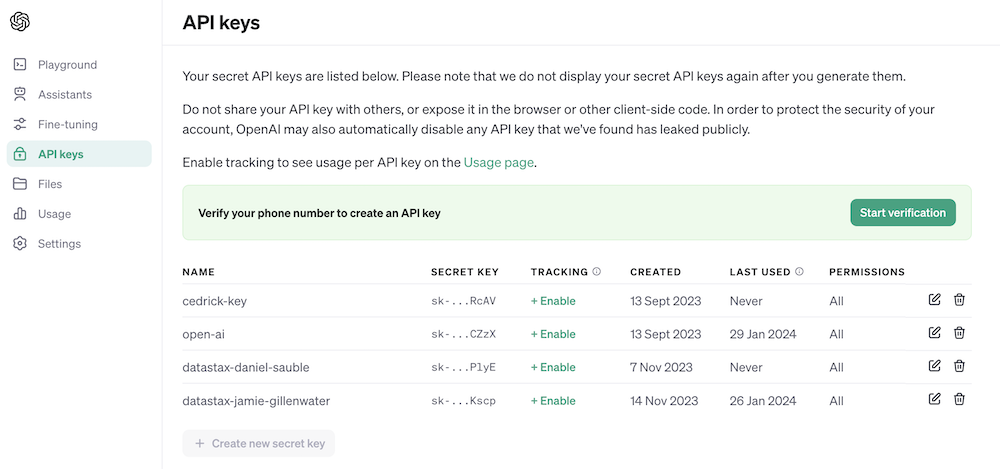

# Build your own RAG Chatbot
Welcome to this workshop to build and deploy your own Chatbot using Retrieval Augmented Generation with Astra DB and the OpenAI Chat Model.

It leverages [DataStax RAGStack](https://docs.datastax.com/en/ragstack/docs/index.html), which is a curated stack of the best open-source software for easing implementation of the RAG pattern in production-ready applications that use Astra Vector DB or Apache Cassandra as a vector store.


What you'll learn:
- 🤩 How to leverage [DataStax RAGStack](https://docs.datastax.com/en/ragstack/docs/index.html) for production-ready use of the following components:
    - 🚀 The [Astra DB Vector Store](https://db.new) for Semantic Similarity search
    - 🦜🔗 [LangChain](https://www.langchain.com) for linking OpenAI and Astra DB
- 🤖 How to use [OpenAI's Large Language Models](https://platform.openai.com/docs/models) for Q&A style chatbots
- 👑 How to use [Streamlit](https://streamlit.io) to easily deploy your awesome app to the internet for everyone to see!


## Prerequisites
This workshop assumes you have access to:
1. [A Github account](https://github.com)

During the course, you'll gain access to the following by signing up for free:
1. [DataStax Astra DB](https://astra.datastax.com) (you can sign up through your Github account)
2. [OpenAI account](https://platform.openai.com/signup) (you can sign up through your Github account)
3. **[Optional]** [Streamlit](https://streamlit.io) to deploy your amazing app (you can sign up through your Github account)

Follow the below steps and provide the **Astra DB API Endpoint**, **Astra DB ApplicationToken** and **OpenAI API Key** when required.

### Sign up for Astra DB
Make sure you have a vector-capable Astra database (get one for free at [astra.datastax.com](https://astra.datastax.com))
- You will be asked to provide the **API Endpoint** which can be found in the right pane underneath *Database details*.
- Ensure you have an **Application Token** for your database which can be created in the right pane underneath *Database details*.


### Sign up for OpenAI
- Create an [OpenAI account](https://platform.openai.com/signup) or [sign in](https://platform.openai.com/login).
- Navigate to the [API key page](https://platform.openai.com/account/api-keys) and create a new **Secret Key**, optionally naming the key.



### Download Repository

1. Please visit the GitHub repository at: [Repository](https://github.com/oktytncy/build-rag-chatbot/tree/main)

2. Click <span style="color:green"><> Code</span> and choose one of the method to download files.

    

3. You can download the ZIP file from the link, or if you have Git installed on your computer, you can use the following command to download it:

    ```git
    git clone https://github.com/oktytncy/build-rag-chatbot.git
    ```

### Create a Virtual Environment [Optional] 

Some environments can be managed externally by a system package manager, such as Homebrew in macOS. 

This means that your system may prevent you from installing packages globally to avoid conflicts with packages managed by the system package manager. This may pose an obstacle to package installation.

**To avoid this issue, you can Create a Virtual Environment before running python or pip commands.**

```bash
cd "<YOUR-INSTALLATION-PATH>"
```

#### on Linux/Mac/..

Install environment and activate the virtual environment.

```python
python3 -m venv myenv
```

```bash
source myenv/bin/activate
```

#### on Windows

Install environment and activate the virtual environment.

```python
python3 -m venv myenv
```

```bash
myenv\Scripts\activate
```

In PowerShell, you might need to change the execution policy to allow the activation script to run. You can do this by running PowerShell as Administrator and executing the following command:

```powershell
Set-ExecutionPolicy -ExecutionPolicy RemoteSigned -Scope CurrentUser
```

Then, activate the virtual environment with:

```powershell
.\venv\Scripts\Activate.ps1
```

Once the virtual environment is activated, you will see its name in the prompt, indicating that any Python or pip commands will now run within this isolated environment. You can then install packages using pip.

### Install Required Packages

```python
pip3 install -r requirements.txt
```

### Run application
 
Before we continue, we have to provide the ASTRA_API_ENDPOINT, and ASTRA_TOKEN, OPENAI_API_KEY in ./streamlit/secrets.toml. There is an example provided in secrets.toml.example:

```toml
# Astra DB secrets
ASTRA_API_ENDPOINT = ""
ASTRA_TOKEN = ""

# OpenAI secrets
OPENAI_API_KEY = "<YOUR-API-KEY>"
```

#### Please refer to the [README](/step-by-step-app/README.md) file for more detailed instructions!